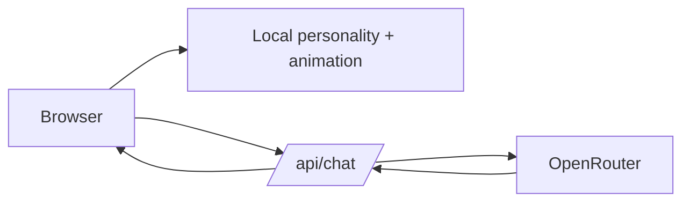

# NEMO 🐾

**A tiny AI creature that lives in your browser.**

NEMO is a software-only virtual companion designed to feel more like a small digital creature than a chatbot. The first milestone focuses on the core loop: original character animation, autonomous idle behavior, cursor attention, browser speech, and an optional OpenRouter-powered language brain.

> Camera, memory, games, and deeper vision are planned milestones — they are not claimed as complete in v0.1.

## v0.1

- Original procedural robot character
- Expressive eyes and state-driven animation
- Autonomous idle mood scheduler
- Mouse-aware gaze
- OpenRouter backend proxy
- Structured AI response validation with Zod
- Offline fallback behavior
- Browser speech synthesis
- Responsive layout
- Reduced-motion support

## Run locally

```bash
npm install
cp .env.example .env
npm run dev
```

Then open `http://localhost:5173`.

Add your OpenRouter key to `.env` to enable the remote brain. The key stays server-side and is never sent to the browser.

## Architecture



The first version intentionally keeps fast interaction local. AI is only used when the user sends a message.

## Project structure

```text
src/
  components/        React UI and NEMO renderer
  systems/           local personality + voice systems
server/              Express API proxy
public/              static assets (future milestones)
docs/                architecture, privacy, roadmap, demo notes
devlog/              real development notes
```

## AI usage disclosure

AI-assisted development is part of this project. Generated suggestions are reviewed and adapted during implementation. Architecture choices, integration decisions, debugging, testing, and final verification remain part of the development process and should be documented honestly in future devlogs.

## License

MIT
